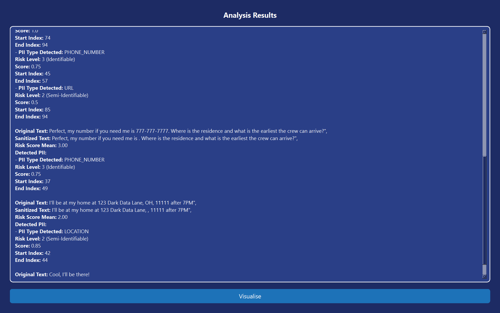

# Privacy Sherlock: Efficiently Uncovering Sensitive Data

## Introduction

In today's data-driven world, the sheer amount of information stored in databases, cloud storage, and file systems is overwhelming. With increasing regulatory pressures such as GDPR, CCPA, and HIPAA, the ability to efficiently identify and manage Personally Identifiable Information (PII) is more critical than ever. **Privacy Sherlock** was developed as a robust, efficient tool designed to discover, classify, and assess risks associated with PII. It leverages state-of-the-art technology to support a wide range of data sources, including PostgreSQL databases and cloud storage services like Backblaze B2. Through accurate identification, classification, and risk assessment, Privacy Sherlock ensures sensitive data is safeguarded and compliant with relevant regulations.

## Solution Overview

Privacy Sherlock operates through a series of steps, including **data ingestion**, **PII detection**, **classification**, and **risk assessment**, ultimately providing comprehensive visualizations to highlight potential vulnerabilities.

The entire code is supported by an intuitive PyQT6 GUI.

---

### **Setup Instructions**

1. **Clone the Repository**:
   ```bash
   git clone https://github.com/Dhruvanshu-Joshi/PII_Tool.git
   cd PII_Tool
2. **Install Dependencies**:
    ```bash
    pip install -r requirements.txt
3. **Run the software**:
    ```bash
    python main.py
    ```
    
---

## Data Ingestion

### PostgreSQL Database Integration

Privacy Sherlock allows seamless ingestion of data from PostgreSQL databases. Using a structured query approach, it fetches PII-related data stored in the database, ensuring every record is scrutinized for sensitive information. This allows organizations to scan their databases quickly for any PII that might pose a privacy risk.

We also provide means to add data to our database by runnning the following command locally:

```
python src/setup_sql.py
```

Note: You must install and setup postgres and also adjust the admin details in ```src/setup_sql.py```.

### Backblaze B2 Cloud Storage Integration

Privacy Sherlock integrates with Backblaze B2, a popular cloud storage service, to fetch data from files stored in the cloud. This cloud integration ensures that even files stored remotely are analyzed for PII. The tool connects via secure API, listing and downloading files for examination, ensuring minimal risk of missing critical data in cloud environments.

---

## PII Detection, Classification, and Risk Assessment

At the heart of Privacy Sherlock’s capabilities is its ability to **detect PII**, **classify it by type**, and **assess the associated risks**. This process is inspired by leading methodologies but customized into a unique and efficient solution.

### 1. PII Detection
Privacy Sherlock uses a combination of advanced regular expressions and machine learning models to detect various types of PII, such as Aadhaar numbers, emails, Social Security numbers, medical reports, etc. Our detection approach is informed by guidelines from the National Institute of Standards and Technology (NIST), Department of Homeland Security (DHS), and frameworks like HIPAA. For textual data, our solution uses natural language processing (NLP) techniques to identify sensitive entities.

### 2. Classification of PII
Once detected, the PII is classified into three major categories, following a risk continuum:

- **Identifiable** (e.g., emails, Social Security numbers) is assigned a high-risk score of 3. This includes any data that can directly identify an individual.
- **Semi-Identifiable** (e.g., partial phone numbers, IP addresses) is categorized with a moderate risk score of 2, as it can identify an individual when combined with other data.
- **Non-Identifiable** (e.g., common names, generic addresses) is assigned a low-risk score of 1, representing minimal risk of re-identification.

### 3. Risk Assessment
Risk is evaluated on a scale from 1 to 3, where each PII token's risk score is calculated based on its type and context. The assessment framework integrates various factors, including sensitivity and regulatory compliance requirements. The overall risk score for a document or dataset is calculated as the **mean of the individual PII risk scores**, ensuring a comprehensive and actionable risk metric.

The formula for calculating a risk score per string of text (or document) is:


where `n` represents the number of detected PII tokens in the text, and `r_s_i` is the risk score of each token. For an entire collection, the mean risk score is:


The result is an actionable risk score for each data source, enabling the prioritization of remediation efforts.

Privacy Sherlock also ensures that detected PII is sanitized or anonymized in its output to prevent any accidental exposure of sensitive data. Detections are marked in the output, such as `<REDACTED>` for email addresses, to preserve privacy during downstream analysis.

---

## Visualization

Visualization is a key component of Privacy Sherlock’s risk communication. It provides intuitive and clear visual representations to help users understand where risks lie and how to address them.

1. **Risk Score Heatmap**: This visualization provides an at-a-glance view of the risk levels across different documents or data entries, using a color-coded matrix to indicate high, medium, and low-risk areas.


   
2. **Scatter Plot of PII Types vs. Risk Scores**: This plot helps correlate the type of PII detected with the associated risk score, allowing users to focus on the highest-risk types of PII such as Social Security numbers or credit card data.


3. **Count of PII Types Detected**: Presented as a bar plot, this visualization provides a breakdown of how often different types of PII are detected, helping organizations focus on the most common or frequent types of sensitive information.


4. **Risk Score Distribution (Box Plot)**: This box plot represents the distribution of risk scores across the analyzed data, showing the spread, median, and outliers. This helps identify datasets with unusually high-risk scores and prioritize mitigation efforts.


5. **Radar Chart for Risk Scores**: This radar chart provides a comprehensive view of the distribution of risk scores across various PII types. By plotting each PII type along the radar’s axes, users can visually assess the concentration of higher-risk PII. The enclosed area gives an intuitive understanding of which types of PII contribute most significantly to the overall risk profile.


6. **Pie Chart for PII Frequencies**: This pie chart illustrates the proportion of each type of PII detected within the dataset. By representing the frequency of PII types in a clear, proportional format, this chart enables users to quickly understand which PII types dominate the dataset and require closer attention.


---

## Screens




---

## Conclusion

Privacy Sherlock is an essential tool in today’s data protection landscape, providing a comprehensive, efficient, and customizable solution to detect, classify, and assess the risk associated with PII. Through its robust integration capabilities, advanced detection methods, and intuitive visualizations, Privacy Sherlock empowers organizations to secure sensitive data while maintaining compliance with regulatory standards. By simplifying the identification and assessment of privacy risks, Privacy Sherlock contributes to a more secure and privacy-conscious data environment.
